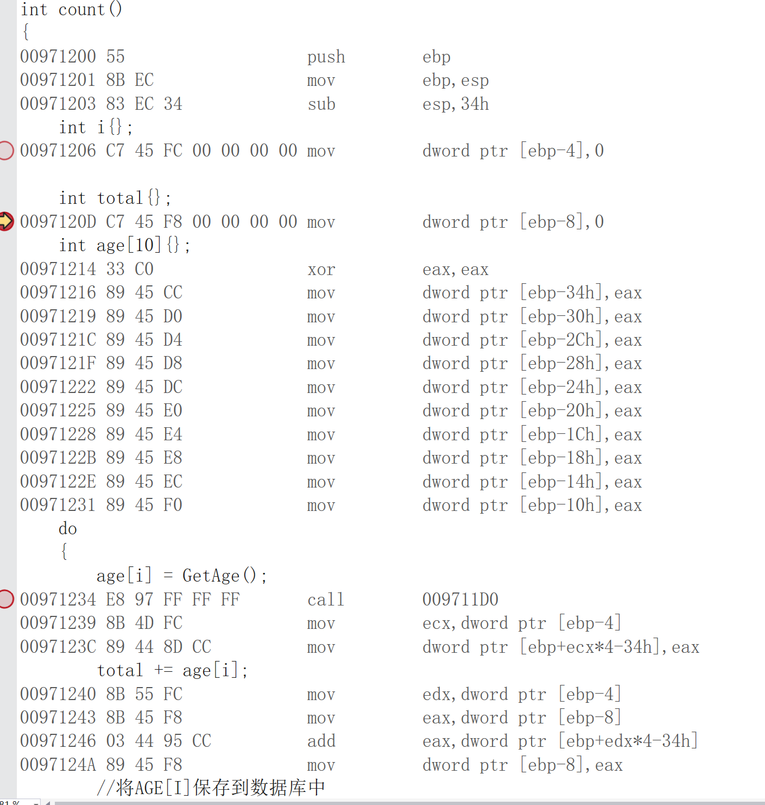
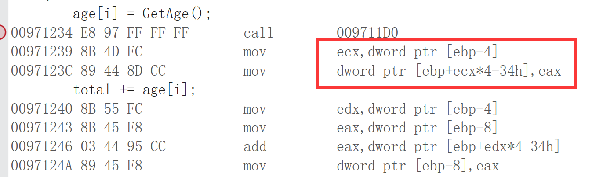

## 1、初始代码
[初始代码](https://github.com/Regret-af/Learnning-Record/blob/master/Day3/stack%20attack/stack%20attack.cpp)

## 2、初始代码的部分汇编代码

## 3、分析
由源代码分析，在 `count()` 函数中存在漏洞，即 `age[]` 仅能容纳 10 个 `int` 型数据，但可以无限制输入，由此推断，可以进行栈攻击

由汇编代码分析，进入 `count()` 函数后， `ebp` 所存即函数返回地址，找到并修改，即可控制程序运行。

根据汇编代码可见，该函数仅仅定义两个`int`型变量，以及一个容量为 10 的 `int` 型数组，占用48个字节，即 0x30。

由 `SUB esp, 34h` 可知栈中开辟了 34h 的空间，由汇编代码初步可知：
- `i` 在栈中位置为 `ebp - 4`
- `totle` 在栈中位置为 `ebp - 8`
- `age` 在栈中位置为 `ebp - 10` 至 `ebp - 34`

`ebp - c` 由其他汇编代码可得为 `age[i]`，不重要，不赘述

故 `age[0]` 距离函数返回地址为 34h（即 52 个字节， 13个 int），即在第 14 个数输入 `Hack()` 函数入口地址即可。

理论成立，试验开始，最终我试验失败。

**_原因为没有注意到如图红框所示汇编代码_**

翻译为：
- ecx = [ebp - 4];
  - `[ebp - 4]` 为 `i` 的值
- [ebp + ecx * 4 - 34h] = eax;
  - `eax` 即为我们的输入值

所以当我们进行第13次输入的时候，即决定了下一次输入的地址，由于我们后续进行 `while` 条件判断的时候 `i` 会自增 1，故我们在第 13 次输入时，输入 13，在下一次输入的时候，输入 `Hack()` 的进入地址。

理论成立，试验开始，最终试验成功！
