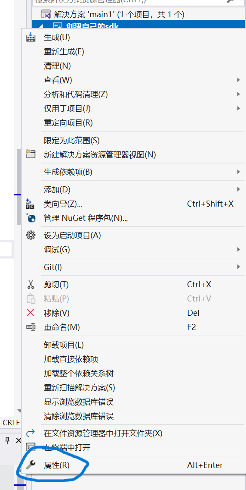
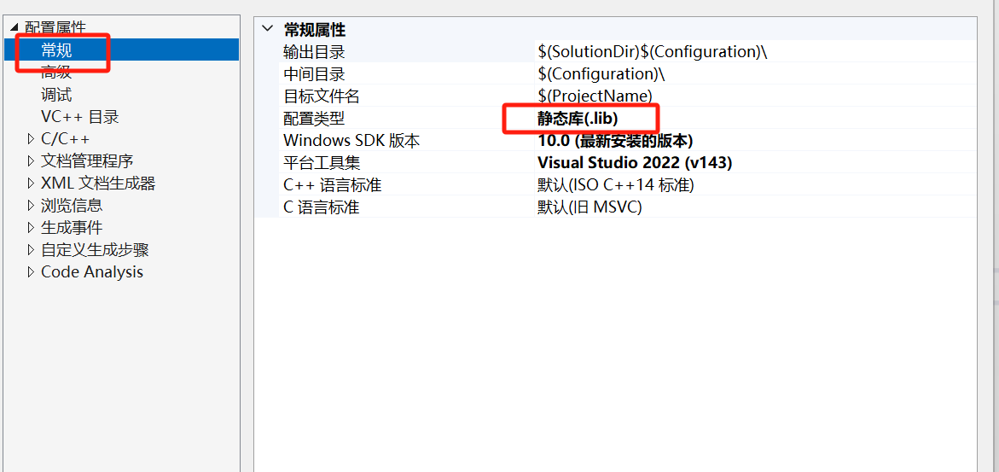
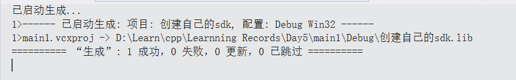
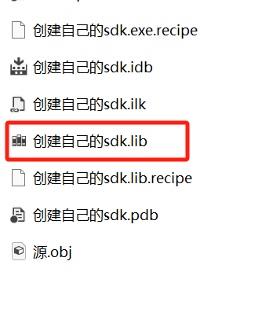
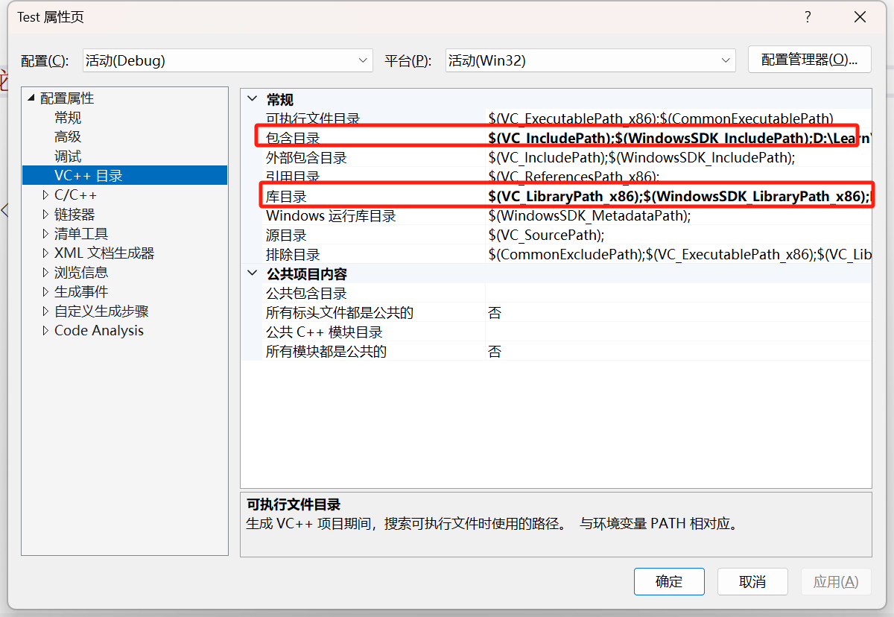
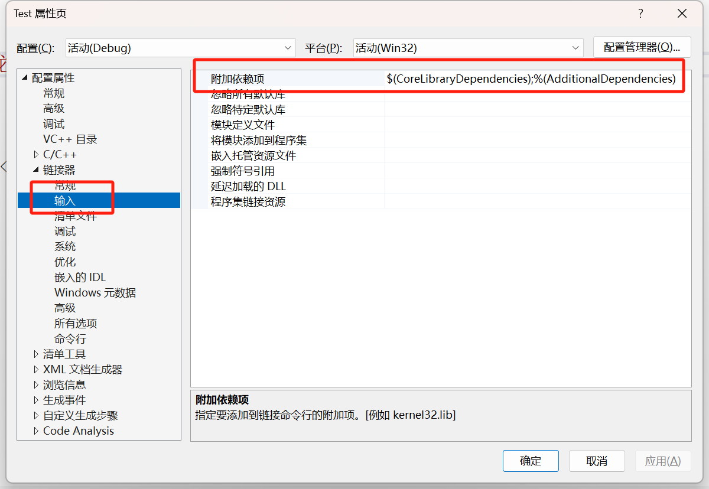

# 创建自己的sdk

==均为 x86 下==

## 1、制作 sdk

### 1.1、编写程序

将自己制作的 sdk 编写好。

### 1.2、生成 .lib 文件

#### 1.选择属性

右击项目，选择属性

#### 2.选择配置类型

选择常规，找到配置类型，选择静态库(.lib)

#### 3.运行程序

直接运行程序，出现以下界面。

#### 4.找到生成的 .lib 文件

根据生成目录，或所在文件夹找到 .lib 文件，如图

#### 5.打包

还需要一个说明书，即步骤一中编写程序的 .h 文件，将两个文件放到同一个文件夹下。重命名为自己想要的名称

**至此，sdk 制作完成！**

## 2、使用 sdk

==x86 环境下！！！==

### 1.选择属性

右击项目，和刚才一样选择属性。

### 2.导入目录

将自己制作的 sdk 导入目录，即将所在目录粘贴到 包含目录 和 库目录下（注意要有分号）

### 3.使用库文件

此时编译器知道这里有库文件，但是不会主动去用，有两种方法可以使得编译器去用

1、使用预编译指令 `#pragma comment(lib, "库文件名称")`

2、添加附加依赖项，右击属性，找到链接器，在附加依赖项中输入要用的库文件名称。（==注意要有分号==）

### 4.成功

此时即可使用自己制作的 sdk！